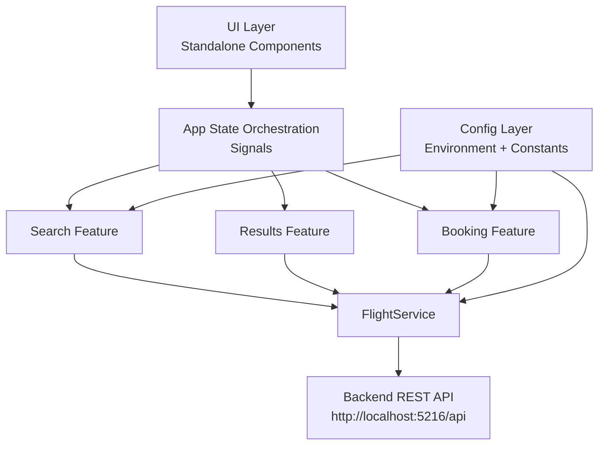

# SkyRoute

## 1) Introduction
- Flight booking frontend for searching flights, sorting/filtering results, entering passenger details, and confirming bookings.
- Spec-driven implementation:
	- Model-first contracts (`Flight`, `SearchRequest`, `Passenger`, `Booking`).
	- Feature-by-feature delivery (search constraints, results sorting, booking validation).
	- Acceptance-driven updates (edge cases and regressions validated with unit tests).

## 2) AI Tooling
- Tool: GitHub Copilot Chat (VS Code).
- Model: GPT-5.3-Codex.
- Usage: Accelerated scaffolding, refactoring, and test-case generation against explicit requirements.

## 3) Architecture Diagram


## 4) Project Structure
```text
src/
	app/
		components/
			search/       # search form, criteria validation, restore behavior
			results/      # sorting/filtering and flight list rendering
			booking/      # passenger form, domestic/international rules
			shared/       # reusable UI (flight card)
		models/         # domain contracts (Flight, Booking, Passenger, SearchRequest)
		services/       # API integration (FlightService)
		config/         # shared constants (airports/country map)
		app.component.* # app shell + signal state orchestration
	environments/     # runtime API base URL config
```

## 5) Tech Stack
- Language: TypeScript `~6.0.2`.
- Framework: Angular `^22.0.0` (standalone components, signals).
- Runtime: Node.js + npm `11.13.0`.
- Test library: Vitest `^4.0.8`.
- Rx: RxJS `~7.8.0`.

## 6) API Reference
- Swagger UI (local): `http://localhost:5216/swagger/index.html`.
- API base URL (frontend config): `http://localhost:5216/api`.

## 7) How To Run Locally
- Prerequisites:
	- Node.js `20+`.
	- npm `11+`.
	- .NET SDK (for backend API).

- Backend (run first):
	- From backend project folder:
		- `dotnet restore`
		- `dotnet run --urls http://localhost:5216`
	- Verify:
		- `http://localhost:5216/swagger/index.html`

- Frontend:
	- From this folder:
		- `npm install`
		- `npm start`
	- Open:
		- `http://localhost:4200`

- Tests:
	- Unit tests: `npm run test `
